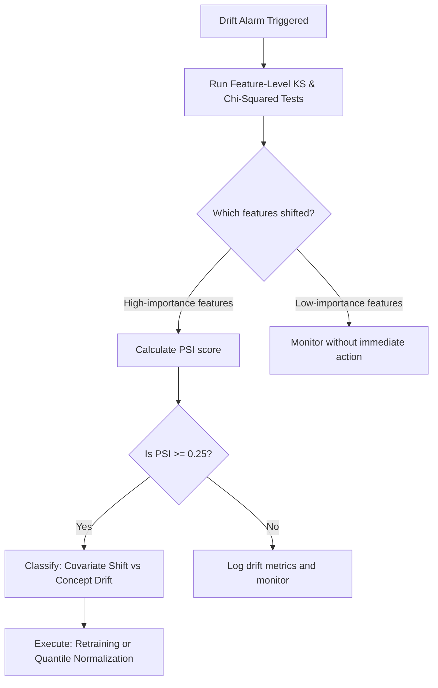

# Troubleshooting Guide: Data Drift (Covariate and Prior Probability)

## 1. Overview and Definitions
In production machine learning systems, data distributions are rarely static. **Data Drift** occurs when the statistical properties of input features or target variables change over time, resulting in a mismatch between the training data and the production traffic. 

There are three primary forms of drift:
1. **Covariate Shift (Feature Drift):** A shift in the input feature distribution $P(X)$, while the conditional probability of the target given features $P(Y|X)$ remains unchanged. The relationship between input and output is constant, but the input values themselves have shifted.
2. **Prior Probability Shift (Label Shift):** A shift in the target label distribution $P(Y)$, while the conditional probability $P(X|Y)$ remains unchanged. For example, a fraud detection model encounters a sudden spike in actual fraud incidents.
3. **Concept Drift:** A shift in the relationship between input features and target labels $P(Y|X)$, meaning a feature value that previously predicted label A now predicts label B.

---

## 2. Common Causes

- **External Environmental Changes:** Seasonal cycles (e.g., shopping habits during Black Friday), macroeconomic shifts, or emergency situations.
- **User Demographic Expansion:** Expanding a service to a new country or launching a mobile application that attracts a younger demographic not represented in the training baseline.
- **Upstream Logging or Hardware Failures:** Broken sensors outputting constant values or calibration updates changing data scales.
- **Data Engineering Changes:** Modifications in pipeline feature scaling, tokenizers, or third-party APIs supplying raw data.

---

## 3. Detection Methods

Aegis AI implements statistical tests to detect drift before it triggers severe accuracy drops:

### Continuous Features: Kolmogorov-Smirnov (KS) Test
The KS test is a non-parametric test comparing the empirical cumulative distribution functions of reference (training) and current (production) datasets.
- **Hypothesis:** $H_0$ is that both samples are drawn from the same distribution.
- **Decision Rule:** Reject $H_0$ if $p\text{-value} < \alpha$ (typically $\alpha = 0.05$). This indicates covariate shift.

### Categorical Features: Chi-Squared ($\chi^2$) Contingency Test
For categorical inputs, Aegis AI constructs a contingency table comparing frequency counts across bins.
- **Hypothesis:** $H_0$ is that categorical class frequencies are independent of the dataset (training vs. production).
- **Implementation:** Run `scipy.stats.chi2_contingency` on `pd.crosstab(reference, current)`. Reject $H_0$ if $p\text{-value} < 0.05$.

### Dataset-Level Drift: Population Stability Index (PSI)
PSI measures the magnitude of change between two distributions over fixed bins.
$$\text{PSI} = \sum \left( (A_i - E_i) \times \ln\left(\frac{A_i}{E_i}\right) \right)$$
Where $A_i$ is the actual proportion in production bin $i$, and $E_i$ is the expected proportion from the reference training data.
- **PSI Thresholds:**
  - $\text{PSI} < 0.1$: Minimal shift; no action required.
  - $0.1 \le \text{PSI} < 0.25$: Moderate shift; monitor closely and prepare for retraining.
  - $\text{PSI} \ge 0.25$: Significant shift; immediate intervention required.

---

## 4. Troubleshooting and Diagnosis Workflow

When a drift alert is triggered, execute the following steps:

1. **Step 1: Isolate Drifting Features:** Run univariate tests to find which inputs are drifting.
2. **Step 2: Assess Feature Importance:** Determine if the drifting features are high-priority inputs (e.g., top-5 SHAP values). If a feature with low importance drifts, the impact on accuracy is low.
3. **Step 3: Analyze PSI Score:** Calculate the PSI score to gauge the magnitude of the distribution shift.
4. **Step 4: Check Preprocessing Pipeline:** Verify that no scaling or tokenization settings were modified.

---

## 5. Resolution and Remediation Strategies

- **Automated Retraining:** If PSI $\ge 0.25$ and the performance window shows degradation, trigger an automated retrain on the newest sliding window of data.
- **Domain Adaptation & Quantile Normalization:** If retraining is costly, normalize features using techniques like Quantile Scaling to align the production feature scale with the training scale.
- **Feature Dropping:** If a feature drifts constantly due to noise and has low predictive power, retrain the model excluding that feature.
- **Reweighting Samples:** Adjust the model loss function by reweighting training samples using density ratios ($P_{\text{prod}}(x)/P_{\text{train}}(x)$).
