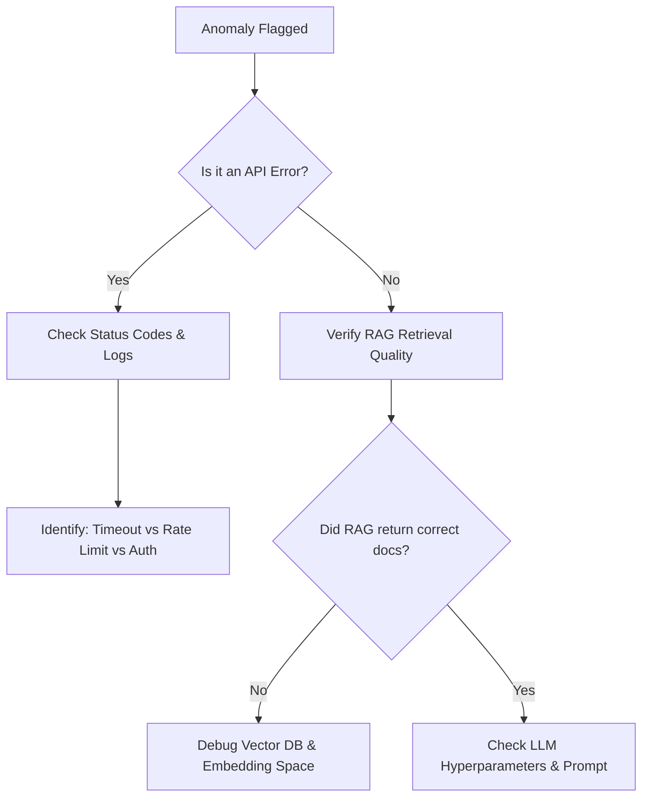

# Troubleshooting Guide: LLM Hallucinations and API Issues

## 1. Overview and Definitions
In production agentic architectures, language models are prone to two distinct but interlinked failure modes: **semantic hallucinations** (where the model generates plausible-sounding but factually incorrect or ungrounded responses) and **API execution failures** (where upstream service interruptions, rate limits, or structural schema mismatches prevent downstream workflows from executing).

Aegis AI relies on structured responses and grounding context to prevent these failures. When a model hallucinates, the self-healing engine can be misled into applying incorrect fixes or classifying anomalies incorrectly. Similarly, API exceptions can halt the healing loop entirely if not gracefully managed.

---

## 2. Common Causes

### LLM Hallucinations
1. **Context Under-Grounding:** The prompt does not contain the required facts, prompting the LLM to draw from its static pre-training data, which may be outdated or incorrect.
2. **Excessive Generation Temperature:** Higher temperature configurations (e.g., > 0.7) increase the likelihood of random token selection, degrading factual correctness in analytical tasks.
3. **Ambiguous Queries & Prompts:** The instructions fail to define boundaries, allowing the model to make wild assumptions.
4. **Knowledge Retrieval Mismatch:** The RAG pipeline retrieves irrelevant documents (low context precision/recall) due to embedding space misalignment.

### API Issues
1. **Rate Limiting (HTTP 429):** Exceeding token-per-minute (TPM) or request-per-minute (RPM) quotas.
2. **Timeouts:** High-latency network segments or heavy backend loads causing connection drops.
3. **Authentication & Token Expiry:** Incorrectly rotated keys or configuration errors.
4. **Schema Outages:** Changes in model output formats that violate the strict Pydantic parsing structures defined in `src/monitoring/models.py`.

---

## 3. Detection Methods

To identify hallucination and API issues in real-time, Aegis AI deploys several detection mechanisms:

- **RAGAS Faithfulness Metric:** Evaluates if the LLM's generated response is strictly derived from the retrieved contexts. The target score is $\ge 0.85$.
- **LLM-as-Judge Validation:** A dedicated, low-temperature prompt asks a secondary judge model to output a binary evaluation of whether the response contains assertions not found in the source documents:
  ```json
  {"faithful": false, "reason": "The response claims database retraining takes 5 hours, but the guide states it takes 15 minutes."}
  ```
- **Pydantic Schema Validation:** Catches structural formatting failures immediately during response parsing (e.g., missing mandatory JSON keys).
- **HTTP Status Monitoring:** Detects rate limits and timeout exceptions via response status code checks (e.g., 429, 503, 504).

---

## 4. Troubleshooting and Diagnosis Workflow

When a hallucination or API issue is flagged by the monitoring engine, follow this diagnostic sequence:



1. **Step 1: Check System Logs:** Inspect the API response payloads. If the API returned a failure status (4xx/5xx), route to API remediation.
2. **Step 2: Inspect Retained Context:** If the failure is a hallucination (faithfulness drop), pull the retrieved document metadata. Determine if the vector database returned relevant documentation.
3. **Step 3: Analyze LLM Temperature:** Check the model invocation settings in the active configuration file (`config/settings.yaml`).

---

## 5. Resolution and Remediation Strategies

### Remediation for Hallucinations
- **Strict Grounding Prompts:** Force the LLM to acknowledge its limitations. Modify prompt templates to include clear boundary instructions:
  ```markdown
  You are a factual assistant. Answer the question using ONLY the provided context. 
  If the context does not contain the answer, reply: "I do not have enough information." 
  Do not make assumptions or extrapolate.
  ```
- **Temperature Minimization:** For diagnostic tasks, enforce a temperature setting of $0.0$ to $0.2$.
- **Contextual Filtering (MMR):** Adjust the retrieval strategy in `AegisRAG` to use Maximal Marginal Relevance (MMR) with a diversity factor ($\lambda = 0.7$) to avoid redundant or confusing context blocks.
- **Few-Shot Prompting:** Insert 2-3 examples of correct input-to-output mappings in the prompt template.

### Remediation for API Issues
- **Exponential Backoff and Jitter:** Wrap API requests in retry decorators (such as `tenacity`) using exponential backoff to handle rate limits:
  ```python
  from tenacity import retry, stop_after_attempt, wait_random_exponential
  @retry(wait=wait_random_exponential(min=1, max=60), stop=stop_after_attempt(5))
  def call_llm_api(): ...
  ```
- **Fallback Models:** Configure a secondary model endpoint (e.g., falling back to a local model or a cheaper API provider) when HTTP 429/500 errors occur consecutively.
- **Request Batching & Rate Limiting:** Introduce queuing to throttle outgoing API requests below the registered TPM/RPM limits.
