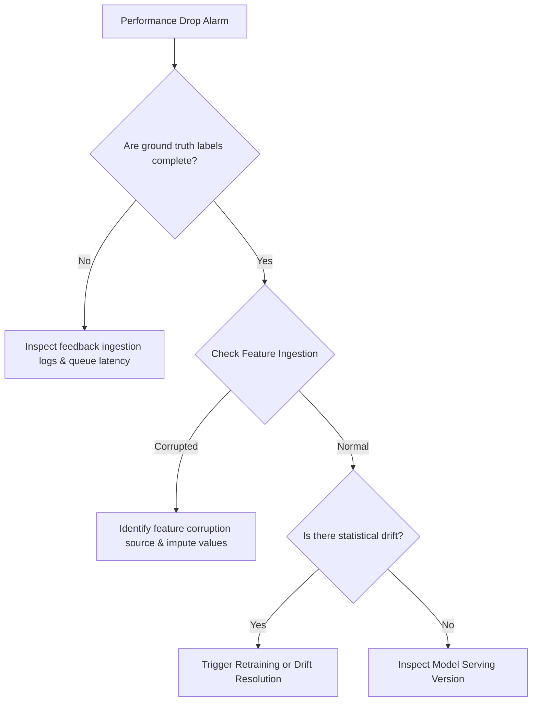

# Troubleshooting Guide: Model Performance and Accuracy Drops

## 1. Overview and Definitions
In production machine learning systems, **Model Performance Degradation** refers to a statistical drop in key evaluation metrics—such as classification Accuracy, F1-score, Precision, Recall, or area under the ROC curve (ROC-AUC)—relative to the baselines established during validation and training.

Aegis AI monitors these metrics in real-time. A performance drop is critical because it directly impacts the business utility of the ML service. Identifying and diagnosing performance degradation requires separating actual model failures from feedback pipeline latency or feature ingestion bugs.

---

## 2. Common Causes

1. **Feature Pipeline Ingestion Failures:** Upstream changes, database schema alterations, or sensor malfunctions can introduce nulls, default values, or corrupted feature vectors into the model.
2. **Training-Serving Skew:** Discrepancies between how features are computed during training (offline) versus serving (online). For example, time-based leakage or different library versions.
3. **Delayed Ground Truth / Label Ingestion:** If evaluation metrics are computed based on incoming feedback, delays in receiving label data can make accuracy appear to drop artificially when it is simply a data completeness issue.
4. **Underlying Data Drift:** Gradual or sudden shifts in the input data distribution, rendering the offline-trained boundaries obsolete.
5. **Model Version Deploy Mistakes:** Accidentally routing traffic to an uninitialized, dummy, or deprecated model version.

---

## 3. Detection Methods

Aegis AI relies on a combination of metrics tracking and automated performance detectors:

- **Sliding Window Performance Trackers:** Computes metrics (Accuracy, F1-score) over configured sliding windows (e.g., last 1000 requests, or past 2 hours of traffic) as implemented in `ModelPerformanceDetector`.
- **Pre-Release vs. Post-Release Deviation checks:** Comparing current production metric values against a baseline configuration stored in `config/settings.yaml`. If the performance drops below a threshold (e.g., accuracy drop $\ge 5\%$), an anomaly event is raised.
- **Data Completeness Auditing:** Tracking the percentage of missing or default values (e.g., `-1`, `NaN`, `"unknown"`) in feature matrices.

---

## 4. Troubleshooting and Diagnosis Workflow

When a performance drop is detected, the following troubleshooting sequence should be executed:



1. **Step 1: Verify Feedback Integrity:** Check if the labels matching the predictions are arriving correctly and are complete. If labels are missing, the metrics are biased.
2. **Step 2: Inspect Ingestion Schema & Features:** Check if any feature has a high percentage of missing values. Run basic descriptive statistics (min, max, mean) on the latest window.
3. **Step 3: Analyze Model Metadata:** Ensure that the API is routing queries to the correct model version and that no default placeholder weights are active.
4. **Step 4: Run Data Drift Checks:** Execute Kolmogorov-Smirnov (KS) tests and Population Stability Index (PSI) calculations on input features against the training baseline.

---

## 5. Resolution and Remediation Strategies

Depending on the diagnosed root cause, apply one of the following remediation workflows:

### Retraining Pipeline Triggering
If performance drops due to natural drift, trigger the automated retraining pipeline using a newly aggregated window of recent production data.
```bash
# Example trigger for retraining job
python pipelines/retrain.py --dataset production_recent --target_model recommender_v2
```

### Model Rollback
If the accuracy drop coincided with a recent deployment, immediately roll back the active model serving version to the last known stable model checkpoint.
- **Semi-auto Action:** The agent recommends the rollback of the model endpoint in the config.
- **Auto Action:** If confidence $\ge 90\%$, update the active model tag in `config/settings.yaml` and reload the service.

### Feature Pipeline Hotfix
If a feature is corrupted (e.g., a third-party API returned null), configure the feature transformer to temporarily substitute missing inputs with training-set medians or fallback default values, preventing NaN propagation into model inference.

### Decision Boundary Adjustment
If the class prior has shifted, dynamically adjust the classification probability thresholds to balance precision and recall targets under the new class distribution.
