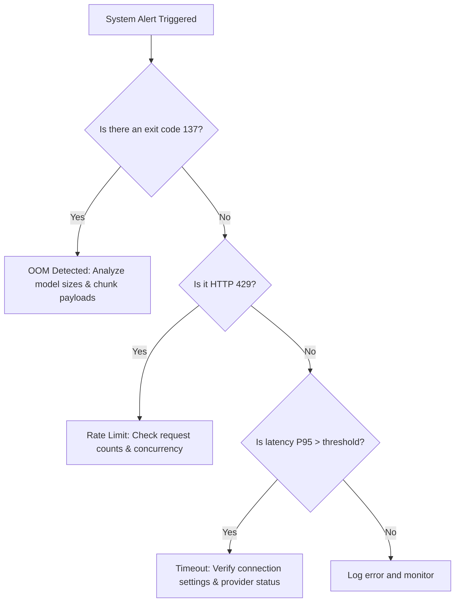

# Troubleshooting Guide: System Issues (OOM, Timeouts, and Rate Limits)

## 1. Overview and Definitions
Production AI pipelines are subject to standard software infrastructure vulnerabilities. In Aegis AI, system-level anomalies generally fall into three categories:
1. **Out Of Memory (OOM) Errors:** The process exhausts physical RAM or GPU VRAM, leading to abrupt OS termination (e.g., exit code 137).
2. **API Timeouts:** Network requests fail to receive a response from upstream LLM APIs, embedding services, or database servers within the allocated socket/read timeout limits.
3. **Rate Limits (HTTP 429):** The application sends requests faster than the rate limits allowed by the API provider, resulting in blocked execution.

Preventing system issues from breaking the autonomous loop is critical. If Aegis AI experiences an OOM or a prolonged timeout, it loses its capability to diagnose and heal other pipeline metrics.

---

## 2. Common Causes

### Out Of Memory (OOM)
- **Model Size Exhaustion:** Attempting to load multiple heavy transformer models (e.g. SentenceTransformer or local LLMs) concurrently on a server with limited RAM.
- **Context Size Bloat:** Processing very large text chunks or long vector DB context windows that exceed token allocations, leading to high memory overhead during attention matrix calculations.
- **Memory Leaks:** Re-instantiating model objects inside local loop scopes rather than maintaining a single global instance, causing memory to pile up.

### API Timeouts
- **Concurrency Bottlenecks:** Multiple workers block on single-threaded synchronous HTTP requests, starving the event loop.
- **Upstream Slowdowns:** The LLM provider experiences server load spikes, or the local ChromaDB database grows large and slows down query times.
- **Misconfigured Sockets:** Setting default timeouts too low (e.g., < 2 seconds) for complex reasoning models that naturally take longer to process responses.

### Rate Limits
- **Parallel Task Execution:** Running multiple agent loops or evaluations concurrently without client-side throttling.
- **Ignoring Throttling Headers:** Failing to respect `Retry-After` or rate-limit tracking headers returned by providers.

---

## 3. Detection Methods

Aegis AI relies on active system monitoring to catch infrastructure anomalies:

- **System Log Regex Matching:** The `SystemIssueDetector` scans log files for telltale strings:
  - `OutOfMemoryError`, `Killed`, `exit code 137`
  - `TimeoutError`, `ConnectTimeout`, `ReadTimeout`
  - `HTTP 429 Too Many Requests`, `RateLimitError`
- **Memory Tracking Metrics:** Monitoring system memory usage percentage in `MetricTracker`. An alert is raised when memory utilization $\ge 90\%$.
- **Latency Monitoring:** Recording P95 request latency for all database queries and API calls.

---

## 4. Troubleshooting and Diagnosis Workflow

When a system issue is flagged, follow this verification flow:



1. **Step 1: Check Process Logs:** Determine if the daemon was killed by the OS (exit code 137) or threw a stack trace.
2. **Step 2: Inspect Token Count:** If the error is an LLM timeout, examine the number of prompt tokens. Large inputs can cause dramatic model response delays.
3. **Step 3: Test Upstream Status:** Run a curl request to the upstream API to determine if the issue is a local connection drop or provider outage.

---

## 5. Resolution and Remediation Strategies

### Memory Management Remediation
- **Implement Singletons for Heavy Models:** Load models (like embeddings) exactly once at the module level. Avoid loading models inside loops or local functions:
  ```python
  # Correct way (relevance_scorer.py)
  _TRANSFORMER_MODEL = SentenceTransformer("BAAI/bge-small-en-v1.5")
  def get_relevance_score(text):
      return _TRANSFORMER_MODEL.encode(text)
  ```
- **Chunk Size Cap:** Enforce strict limits on text chunk sizes (e.g., 800 tokens max) and context windows (e.g., maximum of 5 retrieved documents).
- **Garbage Collection:** Force garbage collection (`gc.collect()`) after executing heavy RAG evaluations.

### Timeout Remediation
- **Dynamic Connection Pooling:** Use HTTPX with connection pooling enabled to reuse open connections.
- **Asynchronous Execution:** Convert blocking synchronous calls to async/await patterns using `asyncio` to prevent event loop blocking.
- **Adjust Timeout Settings:** Increase read timeouts to 30 seconds for reasoning LLMs, and keep connection timeouts short (e.g., 5 seconds) to trigger fast failover.

### Rate Limiting Remediation
- **Client-Side Throttling:** Implement token bucket or semaphore-based rate limiting on the client application side.
- **Dynamic Backoff:** Wrap LLM clients using Retry packages that parse and respect `Retry-After` headers.
- **API Provider Rotation:** Maintain multiple API keys or fallbacks to distribute loads when limits are exceeded.
